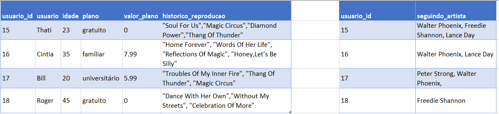
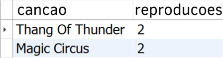
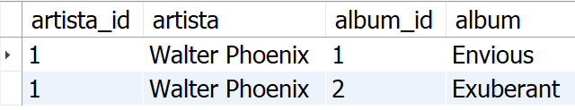

## Problem to be solved

You will get a non-normalized table similar to what could be a simplified version of Spotify's database. The work will consist of two parts:

1. Normalize this table, create the schema in your local database and populate it;

2. Solve the challenges in your normalized and populated bank.

**Warning:** All data in the table below are fictitious and were randomly generated through tools, in order to make the project more real for you 😉. Any similarities to actual information are purely coincidental.

#### Normalize tables to 3rd Normal Form

Below you can view and download a spreadsheet with the tables to be normalized:


[Do the download here](./SpotifyClone-Non-NormalizedTable.xlsx)

First of all, you should normalize these tables to 3rd Normal Form. Assemble as many worksheets and tables as you need to create this normalized version. It is not necessary to create the SQL code at this point.

Although not necessary, it is recommended that you create your worksheets in the sequence 1st -> 2nd -> 3rd Normal Form.

You should be able to find the information below in your tables:

* Information about which plans are available and their details;

* Information about all artists and their details (use information below);

* Information about all albums by each artist (use information below);

* Information about all songs on each album (use information below);

* Information about plans that a user has;

* The relationship that each user has with a plan;

* The relationship that each artist has with an album;

* The relationship that each song has with an album;

* The list of which artists a user is following;

* The list of all songs played by a user or a user.

After you have left the tables in 3rd Normal Form, make any necessary modifications to your tables so that they will be able to store the information described below:

* Artist "***Walter Phoenix***" created the album "***Envious***" with the songs *"Soul For Us"*,*"Reflections Of Magic"* and *"Dance With Her Own" *;

* Artist "***Walter Phoenix***" created the album "***Exuberant***" with the songs *"Troubles Of My Inner Fire"* and *"Time Fireworks"*;

* Artist "***Peter Strong***" created the album "***Hallowed Steam***" with the songs *"Magic Circus"*, *"Honey, So Do I"*,*"Sweetie, Let's Go Wild"* and *"She Knows"*;

* Artist "***Lance Day***" I create the album "***Incandescent***" with the songs *"Fantasy For Me"*, *"Celebration Of More"*, *"Rock His Everything"* , *"Home Forever"*, *"Diamond Power"* and *"Honey,Let's Be Silly"*;

* Artist "***Freedie Shannon***" created the album "***Temporary Culture***" with the songs *"Thang Of Thunder"*, *"Words Of Her Life"* and *"Without My Streets "*.

If your structure still does not meet these requirements, go back to the structure that was created in the previous step and make the necessary changes so that your tables have this information.

---

## SQL Challenges

##### Challenge 1 - Transform Your Spreadsheets into SQL Code

Your challenge now is to take all the structure you created in the previous section and turn it into SQL code. The details are below:

* Create a database named **`SpotifyClone`**;

* Provide the necessary queries to create normalized tables that meet the requirements described in the previous section; 

* Provide the necessary queries to populate the tables according to the data listed in the previous section.

Create only one `SQL` file. Your code should be similar to the following:

```sql
CREATE DATABASE IF NOT EXISTS SpotifyClone;

USE SpotifyClone;

CREATE TABLE table1(
    column1 type constraints,
    column2 type constraints,
    columnN type constraints,
) engine = InnoDB;

CREATE TABLE table2(
    column1 type constraints,
    column2 type constraints,
    columnN type constraints,
) engine = InnoDB;

INSERT INTO table1 (column1, column2)
       VALUES('data example 1', 'data example A'),
              ('data example 2', 'data example B'),
              ('data example 3', 'data example C');

INSERT INTO table2 (column1, column2)
       VALUES('data example 1', 'data example X'),
              ('data example 2', 'data example Y');
```

---

##### Challenge 2

Create a `VIEW` called `musical_stats` that displays three columns. Each column of `VIEW` should display how many times something is registered in the database. Display the number of songs in the first column and give that column the nickname "**songs**". The second column should display the number of artists, and should have the nickname "**artists**". The third column should display the number of albums, and should have the nickname "**albuns**".

Your `VIEW` should return the following information when queried:


---

##### Challenge 3

Create a `VIEW` called `historic_play_users`. This `VIEW` should only have two columns. The first column should be nicknamed "**user**" and should display the username or username. The second column should be dubbed "**name**" and display the name of the song listened to by that user based on their playback history. Results must be sorted by username or user in ascending order.

Your `VIEW` should return the following information, when queried:


---

##### Challenge 4

Create a `VIEW` with the name `top_3_artistas` that displays the identifier code, the name and the number of people who follow this artist. Your `VIEW` should only show the three most popular artists in the `SpotifyClone` bank.

The column representing the artist's identifier code must be called "**artist_id**". The column containing the artist's name should be nicknamed "**artist**". The column with the number of people who are following that artist should be nicknamed "**followers**".

Your result must be sorted in descending order, based on the number of followers.

Your `VIEW` should return the following information, when queried:


---

##### Challenge 5

We are doing a study of the most played songs and we need to know which are the two most played songs at the moment. Create a `VIEW` called `top_2_moment_hits` which should display information about the name of the song and how many times it has been played recently (consider all songs registered in the bank as "recently"). Give the column that has the name of the song the nickname "**cancao**" and the one that has the number of times it was played the nickname "**reproducoes**".

Your result must be sorted in descending order, based on the number of plays. We just want the top 2 most played songs.

Your `VIEW` should return the following information, when queried:



---

##### Challenge 6

We want some information about the company's billing. Based on the value of the plans and the plan that each registered user has in the bank. Create a `VIEW` called `current_billing` which should display four pieces of data. The first column should display the minimum billed with Spotify plans, nicknamed "**billing_minimum**". The second column should display the maximum amount billed, with the nickname "**billing_maximum**". The third column should display the average amount billed to date, with the nickname "**invoice_medio**". Finally, the fourth column should display the total billing, nicknamed "**total_billing**".

Your `VIEW` should return the following information, when queried:


---

##### Challenge 7

Show a list of all albums produced by each artist, along with the number of followers that artist has, according to the details below. Create a `VIEW` called `profile_artistas` which, in the first column, should display the artist identifier value, with the nickname "**artist_id**". The second column should display the artist's name, with the nickname "**artist**". The third column should display the album identifier value, with the nickname "**album_id**". The fourth column should display the name of the album, with the nickname "**album**". The fifth column should display the amount of followers that that artist has and should be dubbed "**followers**".

Your results should be sorted in descending order, based on the number of followers.

Your `VIEW` should return the following information, when queried:


---

##### Challenge 8

Create a trigger called `trigger_user_delete` that should be fired whenever a user is deleted from the database. Your trigger should perform the following actions below, in order:

1. Remove information about this user from the table that stores who he or she was following;

2. Remove information about this user or this user from the playback history;

3. Remove information about this user or this user from the table that shows the user's relationship with your plan.

Test the correct functionality of your trigger by deleting the user 15.

Your trigger must cause the deletion of the user or the user that is passed in all the tables mentioned above. As a result, all references must be deleted, as in the image below:


---

##### Challenge 9

Create a procedure called `artist_albuns` that receives as a parameter the value of an artist's identifier column and in return should display the following four columns: the artist's identifier code, with the nickname "**artista_id**", the artist's name , with the nickname "**artist**", the identifier value of the album produced by that artist, with the nickname "**album_id**" and the name of the album, with the nickname "**album**".

Confirm the correct execution of the procedure, calling it and passing the value "1" as a parameter. Your procedure should return the same as the result below:

`CALL artist_albums(1)`



---

##### Challenge 10

Create a function called `number_songs_in_historic` that displays the number of songs that are currently present in a user's playback history. Upon receiving the identifier code of that user or that user, display the number of songs in your playback history.

Your procedure should return the same result as the image when receiving the value "17" as a parameter:


---

##### Challenge 11

Create a `VIEW` called "*SongsPremium*" that displays the name and number of times each song has been played by users and family or college plan users, according to the details below.

The first column should display the name of the song, with the nickname "**name**". The second column should display the number of plays that song received, with the nickname "**plays**".

Your results should group songs by name and should be sorted by song name in ascending order.

Your `VIEW` should return the following information, when queried:


