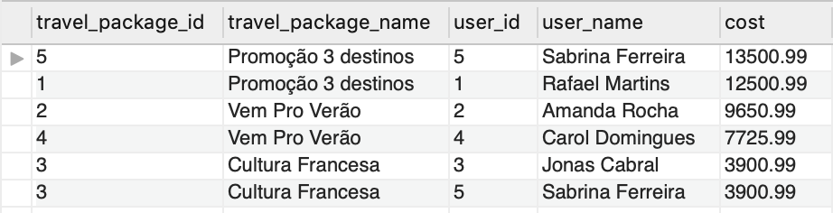
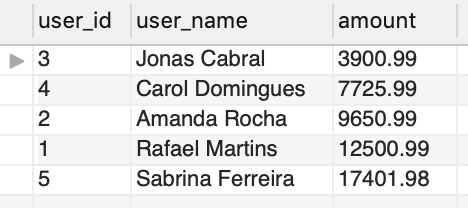
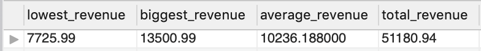
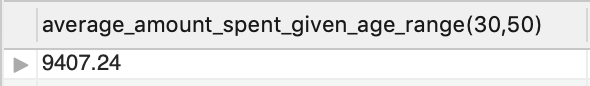

### Problem to be solved 

Imagine that the management of your software development company has asked you to design a database for the following situation:

"We need to assemble the structure of the database that will be used in the travel scheduling system. The structure expected for this module of the system must be able to store important information about the people who use the application, such as: name, age and profession. We must have a way to store information about the possible trips that a person can take, such as: package name, destination (which should at least contain information about the city and country of destination), expected departure date, expected return date and total cost of the trip."

* A person can buy more than one travel package, but **not** can buy the same package twice or more;

* A travel package can have more than one destination;

* A travel package must have the `purchase_count` field, with the default value of 0;

* Every column that represents the unique identifier of the records of a table must have its value automatically generated incrementally, with the exception of tables that are aggregations of other tables (as is the case of the `film_category` table of the `sakila` database, for example).

---

### Data

Keeping in mind the description above, the database structure created must be able to store all the information below:

* Rafael Martins, 33, Architect, hired the "Promotion 3 destinations" package worth R$12,500.99 and has a trip scheduled for 09/25/2022, with the return scheduled for 10/12/2022. The trip must pass through the following destinations:
    - Cape Town, South Africa;

    - Bali, Indonesia;

    - Marrakesh, Morocco.

* Amanda Rocha, 25, Software Developer, hired the package "Vem Pro Verão" worth R$9,650.99 and has a scheduled trip for 10/16/2022, with the return scheduled for 10/26/ 2022 The trip must pass through two different destinations:
    - Paris, France;

    - New York, United States.

* Jonas Cabral, 18, Pintor, hired the "French Culture" package worth R$3,900.99 and has a trip scheduled for 07/12/2022, with the return scheduled for 07/20/2022. The trip has the single destination of:
    - Paris, France.

* Carol Domingues, 37, Contadora, hired the "Vem Pro Verão" package for R$7,725.99 and has a trip scheduled for 02/19/2022, with the return scheduled for 03/26/2022. The trip has the following destinations:
    - Cape Town, South Africa;

    - Bali, Indonesia.

* Sabrina Ferreira, 45, Food Engineer, hired the "French Culture" package worth R$3,900.99 and has a trip scheduled for 07/12/2022, with the return scheduled for 07/20/2022 . The trip has the single destination of:
    - Paris, France.

* Sabrina Ferreira, 45, Food Engineer, also hired the "Promotion 3 destinations" package with the value of R$13,500.99 and has a scheduled trip for the 13/09/2022, with the return scheduled for the 18/ 10/2022. The trip has the following destinations:
    - Marrakesh, Morocco;

    - New York, United States;

    - Paris, France.

Later in this project, you will be asked to populate the database you create with the above data.

---

### Identify the entities

Based on the problem presented above, identify the entities present in the story. Your entities must represent:

* The person (`users`);

* The travel package (`travel_packages`);

* The destination (`locations`);

* The aggregation between travel packages and destinations (`travel_packages_locations`);

* The purchase of travel packages by people (`purchases`).

Your goal here is to have this information somewhere so you can use it in your next steps.

---

### Identify the attributes

Identify and note the attributes of the entities found in the previous step, with the exception of `users`, whose attributes must be:

* `id`: Unique identifier of the person;

* `full_name`: The person's full name;

* `current_age`: Current age of the person;

* `current_job`: The person's current occupation.

Read the problem description again to make sure that, at a minimum, the attributes specified in the description have been identified. All tables must have some identifier field (a field that uniquely identifies the record).

**Tip:** an identifier field can be composed of one or more columns. 😉

Your goal here is to have this information somewhere so you can use it in your next steps.

---

### Identify the relationships

Identify the relationships between each of the entities.

Then create a relationship diagram of the entities `users`, `travel_packages`, `locations`, `travel_packages_locations` and `purchases`.

This sectiono is crucial for you to be able to map and visualize how an entity should relate to others. Your goal here is to have this information somewhere so you can use it in your next steps.

---

### Detailed Entity-Relationship Diagram

Create an entity-relationship diagram containing information about entities, attributes, and relationships

You can make this diagram either on paper or through a diagramming tool like [draw.io](https://www.draw.io/). If you decide to use [draw.io](https://www.draw.io/), watch [this video](https://www.youtube.com/watch?v=lAtCySGDD48) and learn more about this tool . Remember that you can activate the video subtitles, check the automatic translation option and then select the Portuguese language.

This section is also crucial for you to successfully model databases, including the one in this project. Your goal here is to have this information somewhere so you can use it in challenges.

---

## Challenge 1 - Provide the database structure

Provide a single SQL file named `challenge1.sql`, which when executed should:

* Create the database named `queries_unite`, **in lowercase**;

* Set the `queries_unite` database to active;

* Create all necessary tables;

* Populate your bank **only** with the information present in the [**Data**](#data) section (enter only the amounts delivered, **do not change them** to CAPITAL CASSETTES or LOWCASE, enter -them **exactly** as they are in the description).

#### Example of how to populate a database

```mysql
CREATE DATABASE IF NOT EXISTS queries_unite;

USE queries_unit;

CREATE TABLE table1(
    column1 type constraints,
    column2 type constraints,
    columnN type constraints,
);

CREATE TABLE table2(
    column1 type constraints,
    column2 type constraints,
    columnN type constraints,
);

INSERT INTO table1 (column1, column2)
       VALUES('data example 1', 'data example A'),
              ('data example 2', 'data example B'),
              ('data example 3', 'data example C');

INSERT INTO table2 (column1, column2)
       VALUES('data example 1', 'data example X'),
              ('data example 2', 'data example Y');
```

## Challenge 2 - Clone the `users` table

Create a clone called `clone_troopers` for the `users` table.

## Challenge 3 - Change the `clone_troopers` table

Make the following changes to the `clone_troopers` table:

* Add column `nickname`, which must be of type `VARCHAR(50)`, not null;

* Change the `current_age` column so that its type is `TINYINT`;

* Change the column name from `full_name` to `origin_name` and ensure that you cannot enter repeated names;

* Delete the `current_job` column.

## Challenge 4 - Delete the `clone_troopers` table

Delete the `clone_troopers` table.

## Challenge 5 - VIEW travel_package_info

Create a `VIEW` called `travel_package_info`, which should show all purchases registered in the system, displaying the results as follows:

* `travel_package_id`: Unique identification of the travel package;

* `travel_package_name`: Name of the travel package;

* `user_id`: Unique identification of the person;

* `user_name`: Name of the person;

* `cost`: Total cost of the trip.

The `VIEW` results must be sorted by the total cost of the trips in descending order. When searching your `VIEW` without filters you should produce the same results as the following image:



## Challenge 6 - VIEW amount_spent_by_user

Create a `VIEW` called `amount_spent_by_user`, which shows the name and total spent on trips so far by everyone present in the system, according to the following specifications:

* `user_id`: Unique identification of the person;

* `user_name`: Name of the person;

* `amount`: Total spent by the person.

Expenses must be grouped and sorted in ascending order. Searching your `VIEW` without filters should produce the same results as the image below.



## Challenge 7 - VIEW top_3_locations

Create a `VIEW` called `top_3_locations`, which displays the top 3 most frequented destinations, according to the following specifications:

* `id`: Unique identification of the location;

* `city`: Name of the city;

* `country`: Name of the country;

* `travel_amount`: Number of visits to the location.

The results must be grouped by the column identifying the destination and ordered by the number of visits to the location, in descending order. If there is more than one location with the same number of visits, the tie-breaking criterion will be sorting by location id, and growing. Searching your `VIEW` without filters should produce the same results as the image below.


## Challenge 8 - VIEW revenue_report

Create a new `VIEW` called `revenue_report`, which should display a profit report with the following information:

* `lowest_revenue`: Lowest individual profit from a travel package;

* `biggest_revenue`: Maximum individual profit made with a travel package;

* `average_revenue`: Average profit from all travel packages;

* `total_revenue`: Total profit earned from all travel packages.

**Tip:** It is recommended to use subquery to solve this challenge.

Searching your `VIEW` without filters should produce the same results as the image below.



## Challenge 9 - PROCEDURE find_travel_packages_by_period

You should create a `PROCEDURE` called `find_travel_packages_by_period`, which simulates the search functionality with filters. This `PROCEDURE` must receive 2 input parameters: the expected departure date and the expected return date. When executed, it should return only the results contained within the specified date range.

To validate your `PROCEDURE`, run it with the parameters start date and end date, with the respective values ​​of 07/17/2022 (`'2022-07-17'`) and 10/25/2022 (`'2022 -10-25'`). The result should be exactly like the image below:


## Challenge 10 - FUNCTION average_amount_spent_given_age_range

You must create a `FUNCTION` called `average_amount_spent_given_age_range`, which takes as parameters a minimum age and a maximum age. Your `FUNCTION` should only return the average amount spent on package purchases in this age group. The result returned by the calculation must be of type `DOUBLE`.

To validate your `FUNCTION`, run it with the minimum age and maximum age parameters, with the respective values ​​of 30 and 50 years. The result should be exactly like the image below:



## Challenge 11 - TRIGGER increment_travel_package_purchases

You must create a `TRIGGER` called `increment_travel_package_purchases`, which will be fired with each new purchase of a travel package. When triggered, this `TRIGGER` must increment by one the amount of purchases of the package defined in the `purchase_count` column.

To validate your `TRIGGER`, create it before entering your data in the database. If you have already populated the database, you can delete it and regenerate it, having defined the `TRIGGER` before the input commands.

Once the database is populated with the `TRIGGER` defined, execute the query:
```sql
SELECT
    id,
    purchase_count
FROM queries_unite.travel_packages;
```
The expected result for this query is:


## Challenge 12 - INDEX users_full_name_index

To facilitate the search for people registered in the system, add an `INDEX` called `users_full_name_index` in the `full_name` column of the `users` table.

## Challenge 13 - FULLTEXT INDEX users_current_job_index

To facilitate internal profile studies of the people who buy the travel packages, add a `FULLTEXT INDEX` called `users_current_job_index` in the `current_job` column of the `users` table.

---

## Instructions for submitting your project:

### Deliverables

To deliver your project you must create a Pull Request in this repository. This Pull Request must contain the SQL files from challenges 1 to 13.

Any questions, look for monitoring. Remember, you can consult our content on Git & GitHub whenever you want!

### AFTER FINISHING DEVELOPMENT

To submit your project's _Pull Request_ for evaluation, follow the steps below:

* Go to the **OF YOUR** _Pull Request_ page, add the label of _"code-review"_ and tag your colleagues
  * In the menu on the right, click on the _link_ **"Labels"** and choose the _label_ **code-review**
  * In the menu on the right, click on the _link_ **"Assignees"** and choose **your username**
  * In the menu on the right, click on the _link_ **"Reviewers"** and type `students`, select the team `tryber/students-sd-02`

If there is still any doubt about how to deliver your project, [here is an explanatory video](https://vimeo.com/362189205).
