## SQL Challenges 

1. It has been decided that we will continue to serve only region 1. Therefore, using the `countries` table of the `hr` bank as a reference, we need a report in which the country name in the `country_name` column and a second column dubbed `Inclusion Status`, which will display the country status. This second column must be generated based on the value of the `region_id` column and its value must be either "included" or "not included". Use the `IF` or `CASE` conditional commands to generate exactly 25 results, as in the following image:

    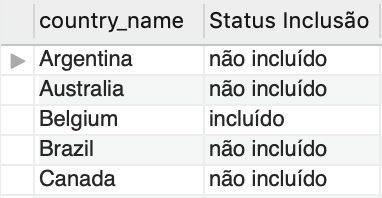

2. We want to categorize the level of each position by salary. Using conditionals, build a query that displays, using the `jobs` table of the `hr` bank, first the `job_title` and, in a second column, the salary level according to the `max_salary` information, dubbed this column "Level". Categorize the compensation levels according to the table below. Your query should produce 19 results, and the columns should be named just like in the reference image:

    5000 - 10000 - Low

    10001 - 20000 - Medium

    20001 - 30000 - High

    Above 30000 - Highest

    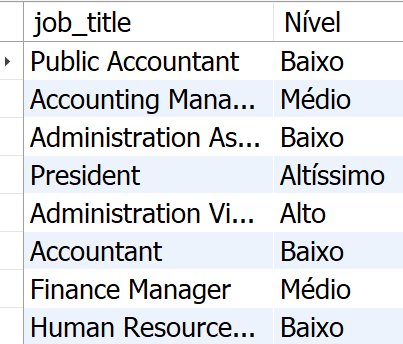

3. Using the `hr` database, create a query that displays the `job_title` of all jobs registered in the `jobs` table. The second column should display the average difference between the minimum wage and the maximum wage of all records in the `jobs` table and should be dubbed "Average difference between minimum and maximum wages". All results must be grouped by `job_title`. Your query must be ordered by the average that was calculated, producing exactly 19 results.

    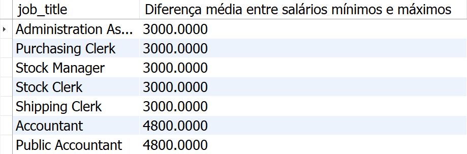

4. Build a query using the `employees` table of the `hr` bank that displays three columns: the `job_id`, with the nickname of "Job Code", the **average salary** of the category, with the nickname of "Average" and finally, the **classification of each category in seniority level**, with the nickname "Seniority", according to the table below. Your results should be sorted in ascending order using the average salary. Assume that the minimum and maximum salaries in the `jobs` table are annual salaries.

    Average between 2000 - 5800 -> 'Junior'

    Average between 5801 - 7500 -> 'Full'

    Average between 7501 - 10500 -> 'Senior'

    Average above 10500 -> 'CEO'

    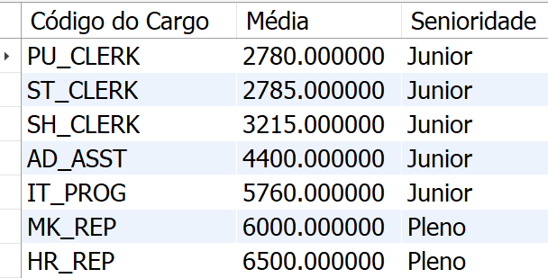

5. We want to display the information in a format closer to the Brazilian reality, so we will be using data from the `jobs` table of the `hr` database. Build a query using the `jobs` table and display four columns. The first column should display the **job name**, with the nickname "Position". The second column should display the **salary variance** between the minimum wage and the maximum wage for that position, nicknamed "Salary Variation". In the third column, display the minimum monthly average for that position, rounding the value to two decimal places. The third column should be labeled "Minimum Monthly Average". Display in the fourth column the **Maximum Monthly Average**, rounded to two decimal places, and call this column "Maximum Monthly Average". Your result must be sorted in ascending order, using the "Salary range" column as a base, and must produce exactly 19 results. Assume that the minimum and maximum salaries in the `jobs` table are annual salaries.

      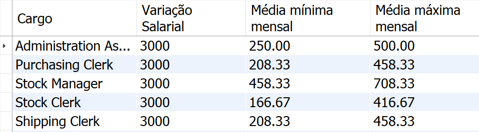

6. Using the `employees`, `jobs` and `departments` tables from the `hr` database, create a query that displays seven columns, the first three being `start_date`, `employee_id` and **full name* * of the employee (don't forget the space between the first and last name) with a nickname of "Full name". The next two columns should display the `job_id` and the **job name**, with the nickname "Job". Next, the next two columns should display the **department id** and the **department name**, with the nickname "Department", of all employees registered in the `job_history` table. Results must be sorted by employee name in descending order. Your query should produce exactly 10 results.

    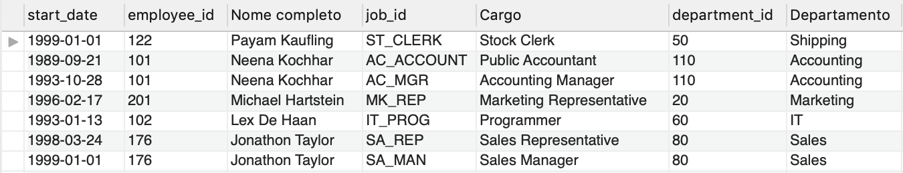

7. Using the `job_history` and `employees` tables from the `hr` bank, create a report with the following characteristics: the first column must contain the `employee_id` of the employee. The second column must contain the **full name** of this employee in ALL CAPS (don't forget the space between the first and last name). Nickname this column "Full Name". The third column should show the employee's start date in that position (`start_date`). The fourth column should display your salary. Only display employees who started in month 1, 2, or 3. Sort your results by full name in alphabetical order. Your query must produce exactly 6 records.

    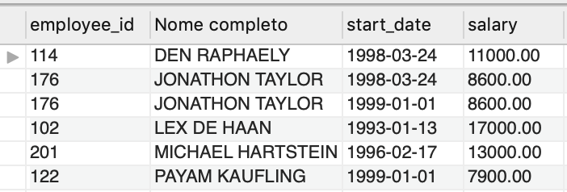

8. Using `JOINS` in the `orders` and `customers` table of the `w3schools` database, display the columns `OrderID`, `CustomerID`, **contact name** of the customer and the shipping company id (`ShipperID`). Results must be sorted by `CustomerID` in ascending order and display only results where `ShipperID` is `1` or `2`. Your query should produce 128 results.

    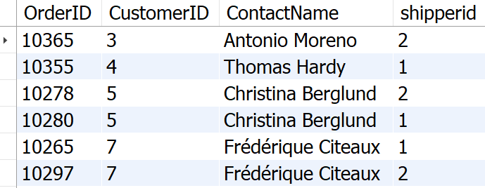

9. Using the `orders` table of the `w3schools` bank, display two columns: the first column must be the `EmployeeId` and the second column must display the total orders already placed by that employee. The second column should have an alias of "Total Orders". Sort your results by total orders in ascending order. Your query should only return 9 results.

    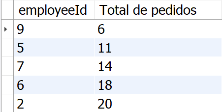

10. Using the `order_details` table from the `w3schools` bank, we want to understand how each product is doing and, for that, we are going to analyze some information about the last orders that were registered. Display four columns, the first of which should be the `ProductID`. The second column should display the **minimum quantity** that has already been ordered of this product and should be nicknamed "Minimum". The third column should display the **maximum quantity** that has already been ordered of this product and should be nicknamed "Maximum". The fourth column should display the **average order quantity** for this product, rounded to two decimal places and labeled "Average". Your query should only display products that have an average number of registered orders above 20.00. Sort your results in ascending order based on average order quantity. Your query must produce exactly 48 records.

    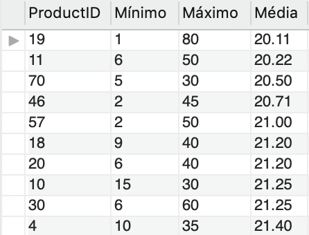

11. We want to know the number of compatriots of each customer present in the `customers` table of the `w3schools` bank. Create a query that displays the customer's **id**, his name, nicknamed "Name", the country he resides in, with the nickname "Country", and the number of people who live in the same country, with the nickname " Number of Compatriots". Results should be sorted by customer name in alphabetical order. Your query should produce 88 results.

    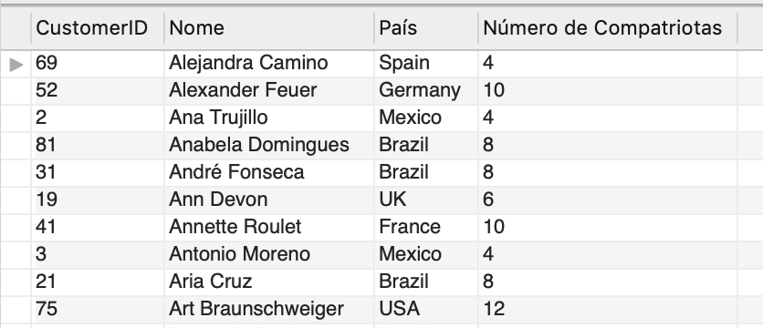

12. Using the appropriate `JOIN` on the `employees` table of the `hr` database, build a query that displays six columns. The first three will be the employee's `first_name`, `salary` and `phone_number`. The next three will be the `first_name`, `salary` and `phone_number` of all employees who have the same job title. Your results should be sorted by the `first_name` of the first column and should produce 1839 results.

    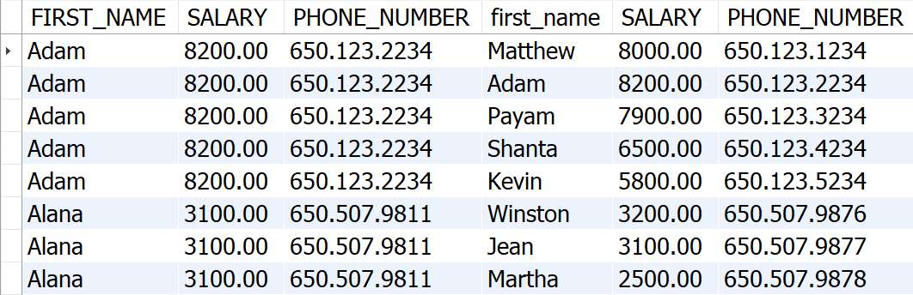

13. Display the **products name** and **product price** registered in the `products` table of the `w3schools` bank. However, only display products that have a corresponding product quantity greater than 80 in the `order_details` table. Your query must produce exactly 3 results and be ordered by product name.

    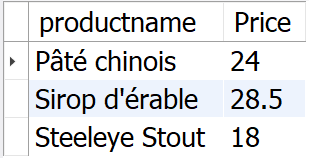

14. The `w3schools` database has countries registered in the `customers` and `suppliers` tables. We want to know which are the first five countries that are registered in the bank, in alphabetical order, in any of the tables. Create a query that returns this result.

    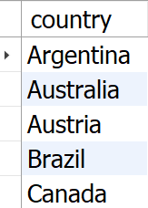

15. Create a procedure called `SearchMediaByJobCategory` that receives a `VARCHAR` parameter corresponding to a `job_id` from the `employees` table of the `hr` database. When executed, your procedure should obtain from the `employees` table the **rounded average salary** for this job, rounded to two decimal places. Important tip: don't forget to include the `USE hr;` line before your procedure declaration. When your procedure is executed with 'IT_PROG' parameter, it should return 5760.00.

    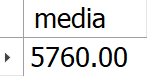

16. Create a function called `BuscarQuantidadeDeEmpregosPorEmployee` that, when receiving the **id of an employee**, goes to the `job_history` table, in the `hr` database and returns the number of jobs already recorded in the system related to that employee. Confirm that your function returns the value **2** when called by passing an employee with id **101**.

    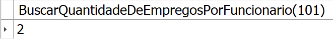

### BONUS:

17. Using the `job_history` table of the `hr` database, create a report that displays the `employee_id`, its start date (`start_date`), in the Brazilian format "dd/mm/yyyy" and with the nickname of "Start Date", your departure date (`end_date`), also in the Brazilian format "dd/mm/yyyy" and nicknamed "Rescission Date", and finally calculate the years worked (nicknamed "Years worked") using the departure and arrival dates as a basis, rounded to two decimal places. Sort your results by `employee_id`. Your query should produce 11 results.

    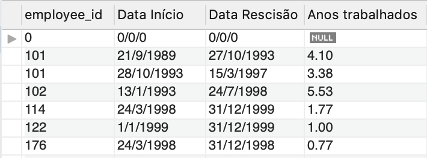

18. Create a function called `DisplayNumberPeopleHiredPerMonthANDYear` that takes two parameters: `month` (no accent) and `year`, both of type `INT`. The function must go to the `employees` table of the `hr` bank and return the **amountof employees** who were hired (`hire_date`) within the `month` and `year` informed. Your function should return the result **14**, when executed with the parameters **month 6 and year 1987**.

     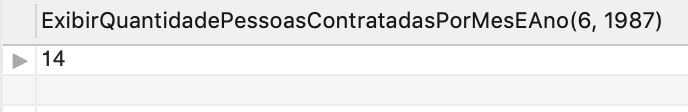

19. Create a procedure called `ExibirHistoricoCompletoPorEmployee` that returns complete information about an employee, using the database `hr`. Your procedure must receive only one `employee_id` parameter of type `INT` from an employee and must display four columns. The first column will be the id itself that was passed. The second will be that employee's full name, with the nickname "Full Name". The third column should contain your job description, with the nickname "Position". The fourth column should display the name of the department where this employee worked, with the nickname "Department". When your procedure is executed with parameter 101, it should return the following listing:

     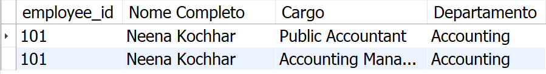
